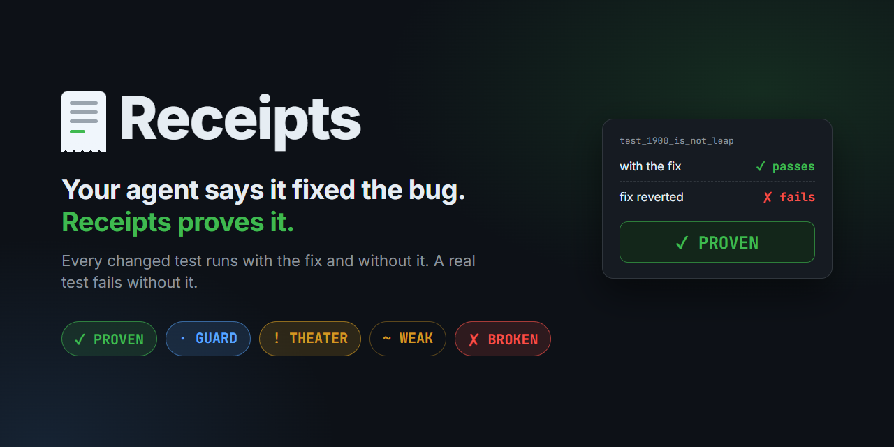
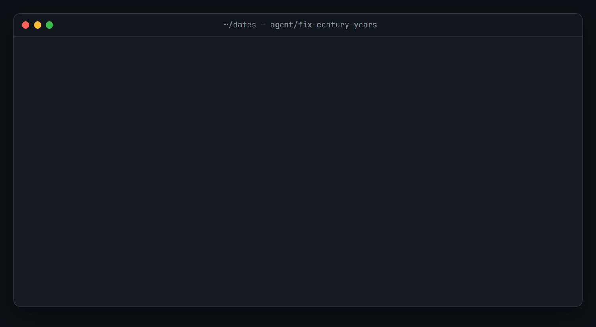
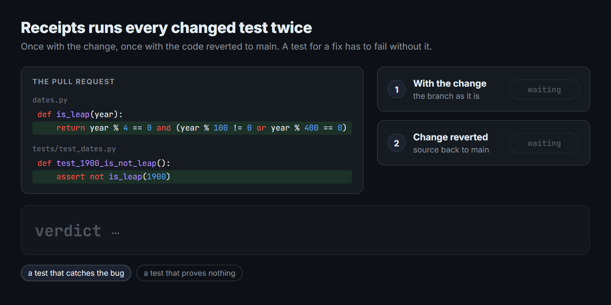
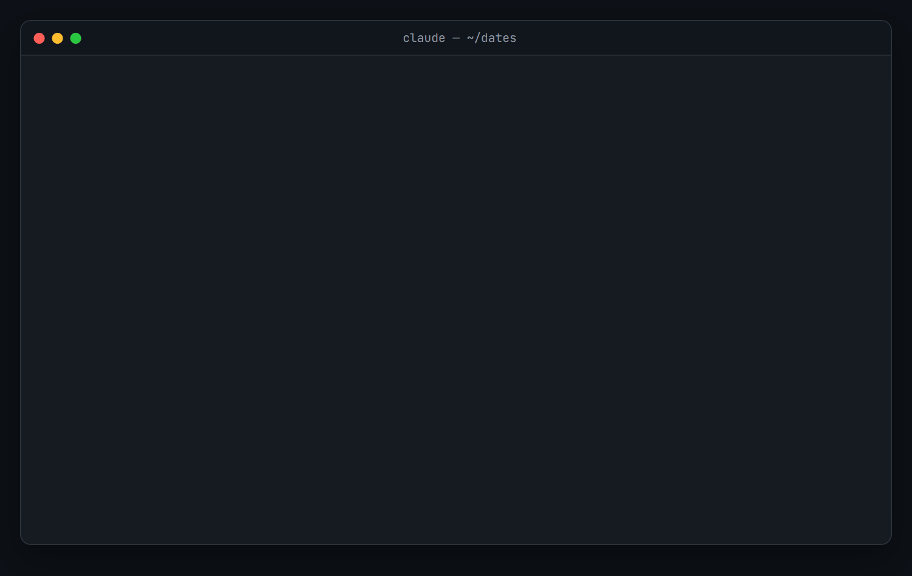
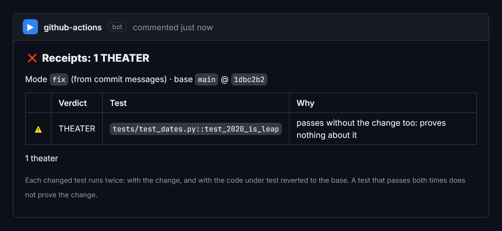

<p align="center">
  
</p>

<p align="center">
  <a href="https://github.com/syntaxixr/receipts/actions/workflows/ci.yml"></a>
  
  
  
  <a href="https://huggingface.co/datasets/syntaxixr/receipts-study"></a>
  <a href="LICENSE"></a>
</p>

<p align="center">
  <b>A green CI says your tests pass. Receipts says whether they would have caught the bug.</b>
  <br>
  <a href="#install">Install</a> · <a href="#how-it-works">How it works</a> · <a href="#verdicts">Verdicts</a> · <a href="docs/study.md">Study</a> · <a href="docs/README.ru.md">По-русски</a>
</p>

<p align="center">
  
</p>

Coding agents now write most of the tests in their pull requests, and CI turns green. But a test that passes with the fix may pass without it too: then it checks nothing about the bug. Receipts runs every test a change adds or edits **twice**, once with the change and once with the code reverted to the base branch, and tells you which tests actually prove the change.

- **Deterministic.** No LLM, no API keys, no code leaves the machine. The verdict is a run of your own tests.
- **Zero dependencies.** Node 20+ and git. It uses your project's own pytest, vitest or jest.
- **Everywhere the work happens:** a skill for Claude Code and other agents, a GitHub Action that comments on the PR, and a CLI.

## How it works

<p align="center">
  
</p>

1. **Diff.** Files changed since the merge base are split into tests, source, and environment (lockfiles, manifests, runner config).
2. **Changed tests.** Test functions (pytest) and `it`/`test` blocks (vitest, jest, including `describe` nesting, `parametrize` rows and `.each` tables) are matched against the changed lines.
3. **Green run.** Those tests run with the change.
4. **Red run.** Only the changed source files go back to the base. Tests, dependencies and config stay new. The same tests run again.
5. **Verdict** for each test, with failures re-run to tell flakes from real failures.

## Verdicts

| | Verdict | With the change | Without it | What it means |
|---|---|---|---|---|
| ✅ | **PROVEN** | passes | fails | The test catches what the change fixes |
| 🛡️ | **GUARD** | passes | passes | Guards neighboring behavior while another test proves the change. Healthy |
| ⚠️ | **THEATER** | passes | passes | No test proves the change: they would all pass anyway |
| 🟡 | **WEAK** | passes | fails on import | The code it calls did not exist yet. Normal for a feature, thin for a fix |
| ❌ | **BROKEN** | fails | | The change does not pass its own test |
| 🔁 | **FLAKY** | mixed | mixed | Different results on the same code |
| ⏭️ | **SKIPPED** | skipped | | The test did not run |

For a **refactor** the expectation flips: every test must pass on both sides (✅ PRESERVED), and a test that fails on the old code means the refactor changed behavior (⚠️ CHANGED). Receipts reads the kind of change from PR labels, a `fix:` / `feat:` / `refactor:` title or commit messages. It also lists tests a change **removed**, and source changes that came with **no test at all**.

## Install

### Claude Code: plugin

```
/plugin marketplace add syntaxixr/receipts
/plugin install receipts-check@receipts
```

The plugin brings the **`prove-fix` skill**: after Claude fixes a bug it runs Receipts on its own tests, and when a test is THEATER it rewrites the test, not the fix, until the change is proven. You can also call it yourself with `/receipts-check:prove-fix`.

It also has a **Stop hook**, off by default, that won't let Claude end a turn while its changed tests prove nothing. Turn it on in a repository you trust with `git config receipts.hook true`. More in [docs/agents.md](docs/agents.md).

<p align="center">
  
  <br><sub>A re-enactment of a real session: the verdicts are real output from Receipts on this change.</sub>
</p>

### Any agent: skill

The same skill works in Claude Code, Codex, Cursor, Gemini CLI, Copilot and other agents that read `SKILL.md`. The CLI is bundled inside it.

```bash
npx skills add syntaxixr/receipts
```

**Claude apps** (claude.ai, Claude Desktop): download `prove-fix.zip` from the [release page](https://github.com/syntaxixr/receipts/releases/latest) and upload it in *Settings → Capabilities → Skills*. It runs where code execution can see your repository.

Prefer plain instructions? [docs/agents.md](docs/agents.md) has an `AGENTS.md` block that does the same with `npx`.

### GitHub Action

```yaml
# .github/workflows/receipts.yml
name: Receipts
on: pull_request          # never pull_request_target

permissions:
  contents: read
  pull-requests: write    # for the report comment

jobs:
  receipts:
    runs-on: ubuntu-latest
    steps:
      - uses: actions/checkout@v7
        with:
          fetch-depth: 0
          persist-credentials: false   # keep the token away from the tests

      # Set the project up exactly as for your normal test job, e.g.:
      - uses: actions/setup-python@v7
        with: { python-version: "3.12" }
      - run: pip install -e . pytest

      - uses: syntaxixr/receipts@main  # or pin a commit SHA
```

The action posts one report on the PR and keeps it updated, writes the job summary, and fails the check on `broken,theater,changed` by default.

<p align="center">
  
</p>

<details>
<summary><b>Inputs and outputs</b></summary>

| Input | Default | |
|---|---|---|
| `fail-on` | `broken,theater,changed` | Verdicts that fail the check. Also: `weak`, `flaky`, `skipped`, `no-tests` |
| `mode` | auto | `fix`, `feat` or `refactor` |
| `base` | PR base branch | Ref to compare against |
| `reruns` | `2` | Extra runs for failing tests, to tell flakes from failures |
| `timeout` | `300` | Seconds per test run; a test still running counts as failed (on the old code: the hang the change fixed) |
| `js-runner` | from `package.json` | `vitest` or `jest` |
| `python` | `python` | Interpreter for pytest |
| `working-directory` | `.` | Where to run |
| `comment` | `true` | Post the PR comment |
| `github-token` | `github.token` | Token for the comment; only the comment step sees it |
| `comment-author` | `github-actions[bot]` | Login that owns the report comment; change it only with a custom token |

Outputs: `passed` (`"true"` or `"false"`) and `receipt` (path to the JSON receipt).

</details>

### Command line

```bash
cd your-project
npx github:syntaxixr/receipts check
```

It checks committed and uncommitted work against the merge base with `origin/HEAD`, `main` or `master`, and puts every file back when it is done. Nothing to install: the build is committed and has no dependencies. Without npx, clone this repository and run `node plugin/skills/prove-fix/scripts/cli.js check` from your project.

```
receipts check [--base <ref>] [--mode fix|feat|refactor] [--fail-on <verdicts>]
               [--reruns <n>] [--timeout <sec>] [--python <path>] [--js-runner vitest|jest]
               [--committed] [--json <file>] [--markdown <file>]
receipts restore
```

Exit codes: `0` pass, `1` a `--fail-on` verdict was found, `2` Receipts itself failed.

## What we found on real code

We ran Receipts over 181 real changes: 81 maintainer fix commits in twelve libraries (click, sqlparse, marshmallow, dateutil, dayjs…) and 100 pull requests with coding-agent fingerprints in five agent-heavy repositories (Claude Agent SDK, OpenAI Agents SDK, MCP Python SDK, fastmcp, simonw/llm).

| | Proven | Mixed | Unproven | Weak only |
|---|---|---|---|---|
| Maintainer fix commits | **90%** | 3% | 7% | 0 |
| Agent pull requests | **82%** | 5% | 2% | **10%** |

Most tests do their job. The gap that shows up only in agent work is WEAK: in 10% of agent PRs every test failed on the old code only because it imported a name the change added, so nothing ever ran against the old behavior. Method, caveats and every change with a link: [docs/study.md](docs/study.md). The data is on Hugging Face: [syntaxixr/receipts-study](https://huggingface.co/datasets/syntaxixr/receipts-study).

## Details that matter

- **In place, with a journal.** The red run swaps files in the working tree, not in a separate worktree, because editable installs (`pip install -e .`) keep importing from the original checkout. Every original byte is saved under `.git/receipts-backup` first and restored afterwards, on Ctrl-C too. After a hard kill, `receipts restore` puts everything back.
- **Editable installs for Python.** If the tests import an installed copy from site-packages, the swap cannot reach them. Receipts detects that and reports those tests as SKIPPED instead of guessing.
- **Your environment, your runner.** Receipts runs `pytest`, `vitest run` or `jest` directly, not your `npm test`. Set what the tests depend on (a `TZ`, service URLs, feature flags) on the CI step or in your shell.
- **New names at the top of a test file** make the whole file fail to load on the old code, so all of its tests come out WEAK. Import new names inside the tests that need them.
- **Hangs count.** A test still running at `--timeout` counts as failed, so a fix for a hang is PROVEN.
- **No stale bytecode.** Each pytest run gets its own bytecode cache.

Limits in this version: one JS runner per repository, detected from the root `package.json` (use `working-directory` for a sub-package); pnpm `catalog:` versions are not supported yet; tests are located by pattern, not by a full parser. CI runs on Linux and Windows.

## Security

Receipts runs a change's tests, so it runs the change's code, exactly as your CI's test job does. Run it where you would run those tests anyway: in Actions with `pull_request` (**never** `pull_request_target`), with `persist-credentials: false`.

What Receipts itself guarantees:

- **No runtime dependencies**, and it never downloads a test runner: only the project's installed pytest, vitest or jest runs.
- **Files stay inside the repository.** Every path is validated before the red run touches anything: no symlinked directories on the way (a PR that turns `src/` into a link to `~/.ssh` is refused), no file/directory swaps.
- **Repository text is treated as hostile.** Test names and failure output are stripped of terminal escapes and bidi overrides, cannot break out of code spans in the PR comment, and pass through secret redaction before anything is posted.
- **The PR comment cannot be hijacked**, and the Claude Code hook is opt-in per clone and tells the agent that test names are data, not instructions.

Details and the threat model: [SECURITY.md](.github/SECURITY.md). Report a vulnerability privately via *Security → Report a vulnerability*.

## Roadmap

- Mutation testing limited to the changed lines: "your tests kill 7 of 9 mutants in this diff"
- Go, Java, Rust
- Signed receipts (in-toto attestations) attached to each commit
- Per-agent and per-team stats: how many AI fixes arrive proven

## Development

```bash
npm ci
pip install pytest pytest-xdist
npm test                            # builds, then runs the suite against real pytest, vitest and jest projects
node docs/media/make-media.mjs      # redraws the README images from real runs (needs ffmpeg and Edge or Chrome)
```

The build in `plugin/skills/prove-fix/scripts/` is committed, because the plugin, the skill, the CLI and the Action all run it as is. Rebuild and commit it with every change to `src/`; CI fails when they drift.

## License

MIT
